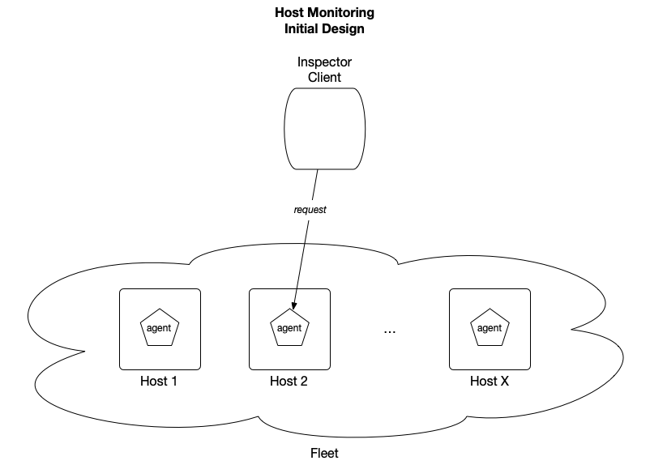

# hostmonitoring
Demonstration project for host inspection.

### Problem
We need to provide on-demand monitoring for arbitrary unix hosts in a fleet.
The key use case is to view `/var/log` without logging onto the host directly.
We've been tasked specifically to provide this access via REST Api.

#### Requirements
Let's make a few assumptions at the outset:

* The "inspector" knows the host (and address) they want to inspect a-priori.
We needn't provide support for finding/listing hosts.
* The "inspector" knows the file (and path) they want to view a-priori.
We needn't provide support for finding/listing files.
* The "inspector" wants to view a single file a time.
Separate files may be viewed by distinct invocations of our solution.
* The "inspector" views log lines via HTTP REST Api.
We should only provide access to files within `/var/log`.
It is OK to parameterize the log root (ex: may be useful for testing).
* The "inspector" is implicitly trusted.
We do not need to design and implement some form of authentication/authorization.
* The host under monitoring is implicitly trusted.
We do not need to protect from the solution being used to exfiltrate host data.

From here, let's write down our requirements:

* Log lines should be returned in reverse chronological order (newest logs first, oldest logs last).
* Support for the following parameters:
    * (required) The filename within `/var/log`.
    * (optional) Filter for log lines by substring match.
    * (optional) Limit the lines by some number `N`.
* Low CPU/memory impact to the host (the host must be able to continue its regular work).
* Must be able to read large log files.
* Key logic implemented directly in the project itself (aka: don't use an existing host monitoring tool/library).
* Files that don't exist in `/var/log` should return an appropriate error (ex: HTTP `404`).
* Only file + filepaths that form a valid absolute path inside `/var/log` should be accessible.

Given these requirements are satisfied, we may consider some future requirements/enhancements.
It may be useful to keep these in mind for the design.

* Provide a CLI/UI client.
* Support inspecting the logs across multiple hosts, via a single host.

Finally, let's list out any non-requirements in order to reasonably constrain the design:

* We do not design for a 'log tailing' use case, whereby the client continuously recieves a stream of "new" log lines.

### Design
We run a lightweight "agent" service on all hosts in the fleet to support viewing files in `/var/log`.
The agent binds a fixed port on the host and responds to HTTP REST requests made from a client.
Requests from multiple clients may be served simultaneously from a single host by establishing separate HTTP connections.
Moreover, different client applications may be built to serve different use cases (ex: CLI, UI, etc).



We define a REST Api for the above requirements.

```
GET http://host:PORT/inspect/filepath ? substring[]=SUBSTRING_1 & substring[]=SUBSTRING_2 & limit=LIMIT
```

Briefly:
* The `filepath` is a required path parameter.
This is the relative path within `/var/log` to inspect.
In the future, we may support directory level inspection (ex: everything under `/var/log`) without breaking support for file inspection.
* The `substring[]` and `limit` parameters are specified as optional query parameters.
* In the future, we support more advanced query parameters such as `regex` for regex-based filtering, or `page` to batch log inspection across requests.

For full details, see the [Api specification](docs/hostmonitoring.yaml) (uses [swagger format](https://swagger.io/)).

For implementation, we use [Rust](https://www.rust-lang.org/) with a simple web server framework called [axum](https://docs.rs/axum/latest/axum/).
There are a few key reasons for this choice:
* Rust is a highly performant programming language.
* Rust provides good memory safety invariants.
* I work with Rust and axum day to day, so it is a comfortable choice.

### Development
Use the following pattern to develop this project.
For runtime user instructions, see [usage](USAGE.md).

    # Build the project
    cargo build
    # Run tests
    cargo test
    # Run style checks (aka: clippy)
    cargo check

### Plan
Basic plan for tackling the implementation:

1. ~~Wire up Cli to execute to agent server program.~~
2. ~~Add axum with `/inspect` route.~~
3. Implement `/var/log` file read (without optional query parameters).
4. ~~Add integration test which actually issues a query to the running the agent.~~
5. Implement substring[] query parameter and extend integration tests.
6. Implement limit query parameter and extend integration tests (the order between this and the previous isn't important).

Future enhancements (might not get to these):
1. Add client side Cli program.
2. Sketch out support for inspecting logs across hosts.
